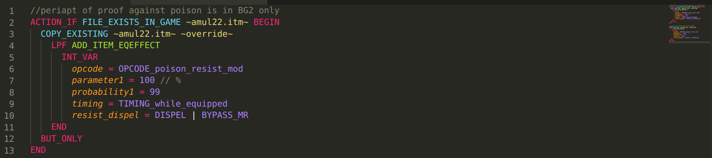

# BGforge MLS IElib
[](https://t.me/bgforge)
[](https://discord.gg/4Yqfggm)
[](https://bgforge.net/irc)
[](https://www.patreon.com/BGforge)

[__Documentation__](https://ielib.bgforge.net)
| [__Forum__](https://forums.bgforge.net/viewforum.php?f=35)

Infinity Engine library for [BGforge MLS](https://github.com/BGforgeNet/VScode-BGforge-MLS). It can be used standalone as well.



Essentially, it defines various constants: opcode numbers, icon numbers, etc, so that they could be used instead of magic numbers, improving overall code readability. (Similarly to what WeiDU [does](https://weidu.org/~thebigg/README-WeiDU.html#sec58).)

__Note:__ it's in alpha, so backwards compatibility is not guaranteed for now.

### Usage

1. Init submodule
    ```bash
    cd mymod
    git submodule add -b master https://github.com/BGforgeNet/BGforge-MLS-IElib.git lib/bgforge
    git commit -m "added BGforge IElib"
    ```
    (__Note:__ once you've added a submodule to your repo, new clones will require an additional step: `git submodule update --init --recursive`.)
2. Enable
    ```
    ALWAYS
      OUTER_SPRINT BGFORGE_LIB_DIR "%MOD_FOLDER%/lib/bgforge"
      INCLUDE ~%BGFORGE_LIB_DIR%/main.tpa~
    END
    ```
3. Browse the code to see the available constants, use [BGforge MLS](https://github.com/BGforgeNet/VScode-BGforge-MLS) to get tips (completion and stuff).

### Update

```bash
git submodule update --remote
git add lib/bgforge
git commit -m "updated BGforge IElib"
```
